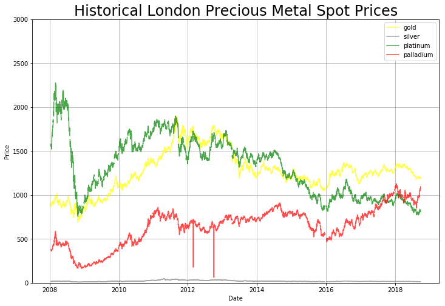
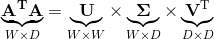
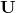
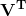
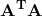
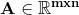

# Eigenportfolios for statistical arbitrage
This analysis shows an application of Principal Component Analysis in order to develop a pairs trading strategy to 
capture statistical arbitrage in the Precious Metals Market. 

We are going to look at how using PCA to create "eigenportfolios" that can be used as a portfolio allocation that captures statistical 
arbitrage between a basket of stocks. 

## Data

This dataset deals with the london fix spot prices for gold, silver, platinum, and palladium. 
It was taken from: 
https://www.perthmint.com/historical_metal_prices.aspx

In this analysis, we used the price data for the past 10 years, from 2008 - 2018. 
The london fix has an AM and PM fix for gold, platinum, and palladium, while it only has 1 fix for silver. 

Since we need to treat the AM and PM fix as different events, we separate this so that each fix represents a 
row in the dataset. Since Silver only has one fix, we will duplicate its fix price for both the AM and PM value. 

Notice the drastic spikes in Palladium in 2012. 
We think this is due to some documentation error or some fluke, so we will exclude these values from our dataset.

## PCA

We are now going to use PCA (Principal Component Analysis) in order to decompose this historical market. 
PCA is a popular technique used in data science to reduce the dimensionality of the data while retaining as much information of the data as possible. 

### Fundamentals of PCA

We now perform Singular Value Decomposition of the Covariance Matrix. 

Where the  corresponds to the Left Principal Components,  corresponds to the diagonlized Eigenvalues in ascending order, and  corresponds to the Right Principal Components.

Theoretically, PCA tries to project a -dimensional space into a smaller -dimensionsal space, where  >> . 

It does this by decomposing the co-variance matrix,  which is the matrix of datapoints 
whose th element is the covariance between the th and th element in a random vector. 

The principal components of the decomposition of the covariance matrix that capture the most information of the dataset 
whenever the dataset is projected onto that vector. The Eigenvalue that corresponds to that eigenvector is how strongly 
that eigenvector explains the variance of the data. The left singular vectors tell us how much each particular row accounts 
for the variance of the data, while the right singular vectors tell us how much each particular column to the data. 

### Interpretation of Eigenvalues and Eigenvectors

Following from our knowledge of what PCA does fundamentally to an arbitrary dataset, how can we interpret it when applied to trading data?

Suppose we have a matrix  that represents a basket of  stocks over  days. Whenever we take take the Principal Component Analysis of this matrix, we are left with a decomposition of the left principal 
components multiplied by the eigenvales multiplied by the right principal vectors. 

The eigenvalues represent how much of the variance of the dataset is captured in each "concept" of the dataset. 

The left eigenvectors can be interpreted as how much the rows (a.k.a the stocks) correspond to each concept. 

The right eigenvectors can be interpreted as how much the columns (a.k.a the daily prices) correspond to each concept. 

After decomposing the Covariance Matrix of our metal prices, we are left with the following interpretation: 

Each eigenvalue corresponds to the how much of the total variance of the data the corresponding principal component captures. 

The corresponding principal component represents a portfolio allocation that captures that amount of variance. 

![hello][imgs/main_eigen.png)

It can be seen from the image above that the eigenvector portfolio allocation that captures the most variance 
(a.k.a. the top eigenvector) is almost identical to the market. 

This phenomenon is due to Krein's Theorem.

When all assets have non-negative correlation, the coefficients of the first principal component are all non-negative. 

We already know that each principal component represents a portfolio allocation. 
Now that we are guaranteed that the first principal component has all non-negative coefficients, we can interpret 
the first principal component as the vector that characterizes "market forces", since it takes a long position in every underlying. 

The corresponding eigenvalue shows how much of the total variance of the data is explained by market forces. 
